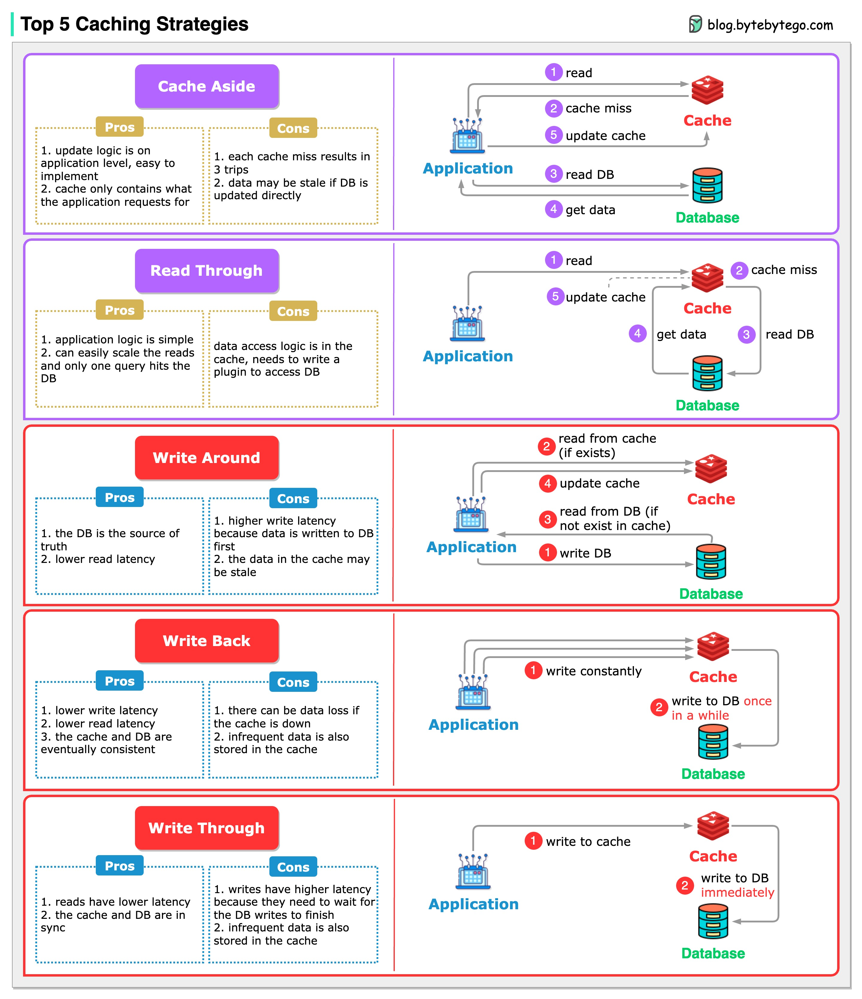

# Caching topology

They are

1. Cache-aside
2. Read-through cache
3. Write-through cache
4. Write-behind cache
5. Write-around cache



## 1. Cache-aside

- Most common topology
- Application code is the orchestrator between the cache and the db

```
            db
            /
service ---
            \
            cache

1. read from cache
2. cache hit?
    yes
        2.1 return the data
    no
        2.1 service reads from db
        2.2 service updates cache
        2.3 return the data
```

- Cache is only populated after a miss

Pros:

- if redis goes down, the application routes queries through the db and keeps function (although slower)
- efficient RAM: only requested data is loaded into cache

Cons

- cache miss penalty: every first request for any data piece will always have a performance hit, since the request must go to the db
- stale data (eventual consistency): if data is updated in the db without being refreshed on cache, the cache returns old data until its TTL expires

> Select cache-aside if you want to maximize system resilience against cache failure and reduce wasting expensive RAM on rarely-acessed data

## 2. Read-through cache

- Application only talks to cache
- Cache is responsible for updating the db

```
service <--- cache ---> db

1. read from cache
2. cache hit?
    yes
        2.1 return the data
    no
        2.1 cache reads from db
        2.2 cache updates itself
        2.3 return the data
```

Pros

- Cleaner application code
- Centralized logic: db fetching logic is moved out of individual microservices and into the caching layer

Cons

- Setup complexity
- Cache staleness

> Select read-through cache if you want to keep the application code clean and isolated from multi-db orchestration and want to avoid scattering the data-fetching logic across multiple services

## 3. Write-through cache

- Highly consistency write strategy
- When the application writes/updates data, it writes both to cache and db
- The write operation is considered successful only when it writes both to the db and cache

Pros

- Strong data consistency
- No cache miss: reads are consistently fast

Cons

- Higher write latency: writes are slower since we need to wait for a roundtrip to RAM (cache) and disk (db)
- Cache pollution: everything is added to cache

> Select write-through if you want to ensure real-time data consistency between the cache and db and want to avoid serving stale data

## 4. Write-back/behind cache

- Application writes only to cache, then a separate, background job async flushes the updates to the db in batches

Pros

- Really fast writes: write latency drops to sub-milliseconds because we write directly to RAM
- Absorbs db spikes: it acts as a buffer

Cons

- Possible data loss: if the redis server crashes before the batch sync to the db, the data is lost
- Complex engineering: handling db downtimes, network splits, and retry logic in the background queue is difficult to implement

> Select write-back if you want to achieve extreme low-latency write throughput while protecting your db from high-volume traffic spikes

## 5. Write-around cache

- Data is written directly to the db, bypassing the cache
- Cache is populated only later, when a read occurs

Pros:

- Prevents cache pollution

Cons:

- Higher initial read latency

> Select write-around if you want to prevent cache pollution
